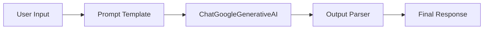

# LangChain LLM Chain Tutorial
### Author: Raquel Selma
This repository contains the code and documentation for a basic LangChain LLM Chain tutorial. It demonstrates how to connect a prompt template with a Google Gemini LLM using LangChain Expression Language (LCEL).

## Architecture and Components

The application follows a simple sequential architecture built using LangChain's LCEL (LangChain Expression Language). 

### Components:
1. **User Input**: A natural language prompt provided by the user.
2. **Prompt Template (`ChatPromptTemplate`)**: Formats the user input into a structured prompt, assigning a "system" role (expert in software architecture) and a "user" role.
3. **LLM (`ChatGoogleGenerativeAI`)**: The Large Language Model (Google Gemini 2.5 Flash) that processes the structured prompt and generates a response.
4. **Output Parser (`StrOutputParser`)**: Converts the raw LLM message output into a clean, readable string.



## Step-by-Step Installation and Execution Instructions

### Prerequisites
- Python 3.8 or higher installed on your system.
- A Google Gemini API Key (You can get it for free from Google AI Studio).

### 1. Clone or Navigate to the Repository
Open your terminal and navigate to the project folder.

### 2. Create and Activate a Virtual Environment
It is recommended to use a virtual environment to manage dependencies.
```bash
# Create the virtual environment
python -m venv venv

# Activate on Windows:
venv\Scripts\activate

# Activate on macOS/Linux:
source venv/bin/activate
```

### 3. Install Dependencies
Install the required Python packages listed in `requirements.txt`:
```bash
pip install -r requirements.txt
```

### 4. Configure Environment Variables
Create a file named `.env` in the root directory of the project and add your Google API key:
```env
GOOGLE_API_KEY=your_google_api_key_here
```

### 5. Run the Code
Execute the main Python script to run the LangChain application:
```bash
python main.py
```

## Example of the Code in Action

When you run `python main.py`, the application will query the Gemini model asking "What is Retrieval-Augmented Generation (RAG)?" and print the response. 


Here is an example of the expected console output:

```text
--- LangChain LLM Chain Tutorial ---
User Request: What is Retrieval-Augmented Generation (RAG)?

Processing...

AI Response:
Retrieval-Augmented Generation (RAG) is a software architecture pattern that improves the quality and accuracy of Large Language Models (LLMs) by grounding their responses in external, verifiable knowledge sources...
[Detailed explanation continues...]
```
